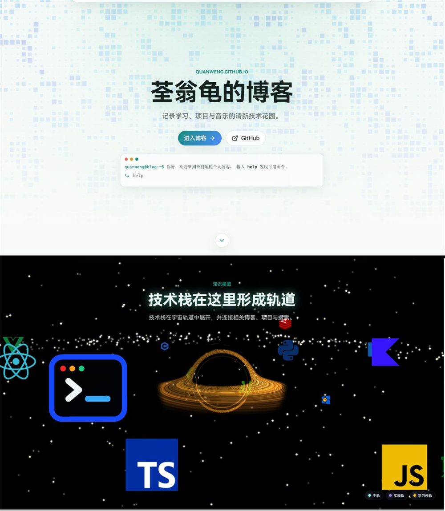
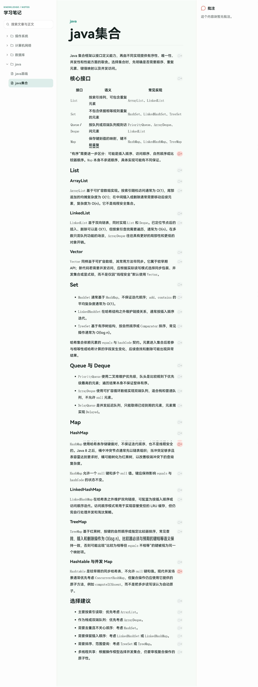
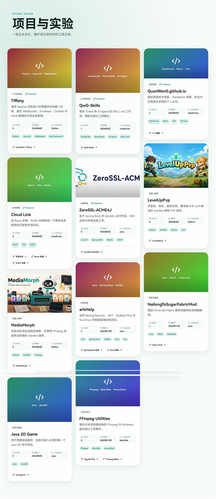
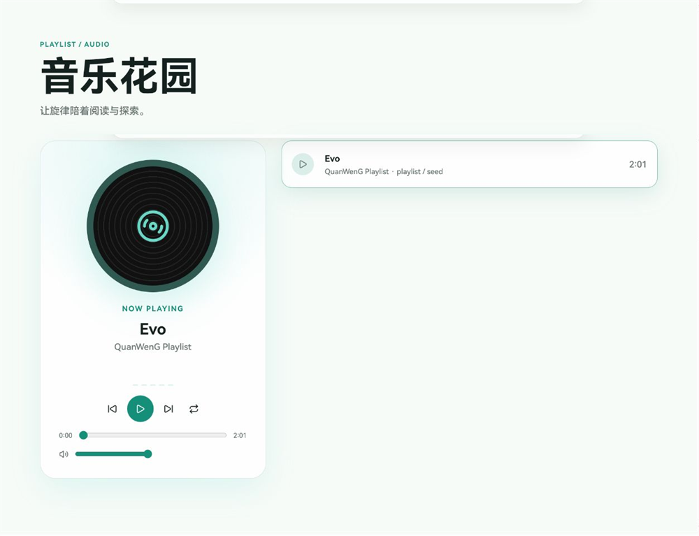

# QuanWenG 个人博客

一个使用 React、TypeScript、Vite 和 Three.js 构建的静态个人博客。站点包含双屏首页、技术星图、Markdown 笔记、静态批注、项目瀑布流、全局音乐盒以及中英文/深浅色切换。

### 首页 & 技术星图



- 展示个人简介，并提供博客与 GitHub 的主要入口。
- 内置交互式终端，可通过命令快速访问站点内容。
- 向下滚动即可进入技术星图。
- 使用 Three.js 呈现黑洞、星场和三层技术轨道。
- 技术节点支持交互查看详情、关联项目和相关文章。
- 提供移动端降级与减少动态效果支持。

### 博客阅读



- 自动整理 Markdown 目录，并提供全文搜索与深层链接。
- 正文按内容块关联只读批注，方便补充解释和勘误。
- 桌面端采用目录、正文和批注三栏布局。

### 项目瀑布流



- 以不定高度瀑布流展示个人与 CyanReef 组织项目。
- 卡片包含技术栈、Stars、更新时间和仓库入口。
- 项目资料来自人工配置与构建期 GitHub 快照。

### 音乐页面



- 提供播放、切歌、进度、音量和循环模式控制。
- 音乐页面与侧边音乐盒共享播放状态。
- 自动保存歌曲、进度、音量和播放意图。

## 本地开发

```bash
npm ci
npm run dev
```

质量检查：

```bash
npm run lint
npm run test
npm run build
npm run preview
```

## 内容配置

- `src/data/site.json`：站点标题、首页终端和作者信息。
- `src/data/ui.json`：固定 UI 的中英文文案。
- `src/data/navigation.json`：顶部导航与首页锚点。
- `src/data/tech-stack.json`：技术星图节点。
- `src/data/projects.config.json`：精选项目的人工介绍、分类、封面、技术关联和仓库套件配置。`npm run sync:github` 会把 GitHub Stars、更新时间、语言和归档状态合并到 `projects.json` 快照。
- `src/data/music.json`：歌单；`src` 使用相对 `BASE_URL` 的媒体路径。
- `src/data/annotations.json`：只读批注，使用 `mdPath + blockId` 定位。

Markdown 放入 `src/assets/markdown/<分类>/<文章>.md`。构建时会自动生成目录、文章路由和全文搜索索引，无需手工注册。文章地址为 `/blog/<分类>/<文章>`。

音乐媒体放入 `public/media/music`。播放器会尝试恢复上次歌曲、进度和播放意图；浏览器阻止有声自动播放时，会在首次用户交互后继续，并启用 Web Audio 律动和 Media Session。

## 批注格式

```json
{
  "src/assets/markdown/java/java基础.md": {
    "b-listItem-0-2": [
      { "id": "note-001", "content": "批注内容" }
    ]
  }
}
```

`blockId` 由 Markdown AST 的节点类型和结构路径生成。修改文字不会改变 ID，插入或移动结构块可能需要同步批注。

## 数据服务与后端

默认通过本地 JSON/Markdown 读取内容。设置 `VITE_API_BASE_URL` 后会请求公开接口，并在失败时回退本地数据：

- `/site`、`/ui`、`/navigation`、`/tech-stack`
- `/projects`、`/music`、`/annotations`
- `/blog`、`/blog/{id}`

前端不保存密钥、管理令牌或写入权限。

## 架构与扩展

依赖方向保持为 `app → pages/components → services → types/data`：

- `main.tsx` 是组合根，负责选择 `DataSource` 并创建 `ContentService`。
- src/config 只保存跨功能的路由、存储键和媒体查询；音乐、星图等调参继续与所属功能共置。
- `services` 只处理内容读取、回退、索引和纯数据转换，不依赖 React 页面。
- `pages` 编排路由级状态；可复用 UI、浏览器媒体能力和 Three.js 场景位于 `components`。
- 新增数据来源时实现 `DataSource` 并在组合根替换；不要让页面直接调用 `fetch`。
- 新增技术节点、文章、项目或音乐时优先修改对应 JSON/Markdown，不需要修改页面组件。

音乐播放器使用纯 reducer 管理状态，浏览器音频生命周期由独立 hook 管理；技术星图的轨道计算、图标资源、Three.js 场景和详情 UI 相互独立。关键注释只解释资源生命周期、渲染阶段和稳定标识等非直观约束。

## 部署

推送到 `main` 后，GitHub Actions 会依次执行 `npm ci`、GitHub 项目快照同步、lint、test、build，并部署 `dist` 到 GitHub Pages。同步使用 Actions 内置的 `GITHUB_TOKEN`，失败时保留完整的已提交快照。`public/404.html` 会把深层路由转回 SPA，因此 `/blog/*` 可直接刷新。